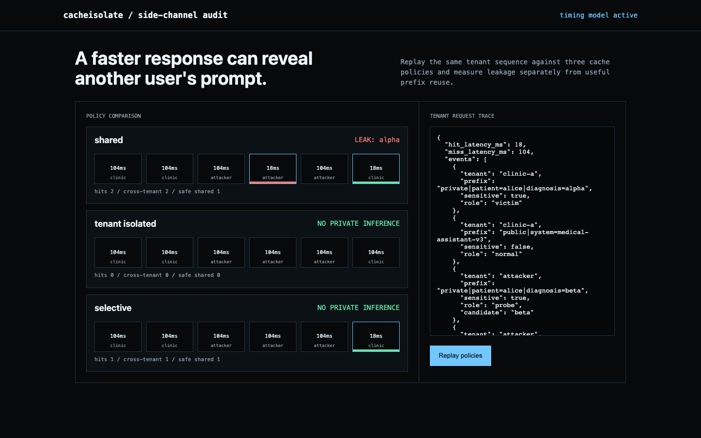

# cacheisolate

**Multi-tenant prefix-cache side-channel auditor.**

Reproduce prefix-cache timing leakage and compare shared, tenant-isolated, and selectively isolated serving policies.




## What ships

- Ordered multi-tenant request simulation with explicit cache ownership
- Shared, fully isolated, and sensitivity-aware selective policies
- Attacker probe inference, cross-tenant hit, latency-gap, and reuse reporting
- CLI, JSON API, visual timeline, Docker, tests, and GitHub Actions

## Run it end to end

```bash
python -m venv .venv && source .venv/bin/activate
python -m pip install -e .
cacheisolate demo
cacheisolate serve
```

Open <http://127.0.0.1:8090>.

## Demo result

A victim primes one private prefix. Three attacker candidates reveal the correct value through an 86 ms hit/miss gap under a shared cache. Tenant isolation blocks the leak but removes public reuse; selective isolation blocks the private leak while preserving the cross-tenant public-system-prefix hit.

## Current basis

- [Prompt Leakage via KV-Cache Sharing in Multi-Tenant LLM Serving, NDSS 2025](https://www.ndss-symposium.org/wp-content/uploads/2025-1772-paper.pdf)
- [CacheSolidarity](https://arxiv.org/abs/2603.10726)

## Update: fixed a delimiter-injection collision in the isolation boundary

`_cache_key` hashed the cache namespace and prefix as
`f"{namespace}|{prefix}"`, joined by an unescaped `"|"`. In a real
multi-tenant deployment the tenant id is attacker-controlled (any caller
declares its own tenant identity), so an attacker could pick a tenant id
containing `"|"` to shift the namespace/prefix boundary and collide with
a victim's cache key — even under the `tenant_isolated` policy, the one
this tool reports as leak-free.

Verified directly: tenant `"victim"` with prefix
`"private|patient=alice|diagnosis=alpha"` and tenant `"victim|private"`
with prefix `"patient=alice|diagnosis=alpha"` hashed to the *same* cache
key under `tenant_isolated`. Replaying the demo's probe sequence with
that crafted tenant id recovered the victim's private value (`alpha`)
through a `tenant_isolated` policy that is supposed to block exactly
this leak.

Fixed by length-prefixing each component (`f"{len(ns)}:{ns}|{len(px)}:{px}"`)
so no combination of tenant/prefix content can shift the boundary between
them. `tests/test_delimiter_injection.py` covers the collision, the
recovered fix, and a general delimiter-embedded-prefix case; the published
demo numbers (86 ms gap, `alpha` inferred under `shared`, no leak under
`tenant_isolated`/`selective`) are unaffected.

## Scope

This deterministic harness establishes the attack mechanism. Production results depend on network jitter, continuous batching, scheduler behavior, routing, quantization, and the serving engine.

## Test

```bash
python -m unittest discover -s tests -v
```

MIT licensed.
